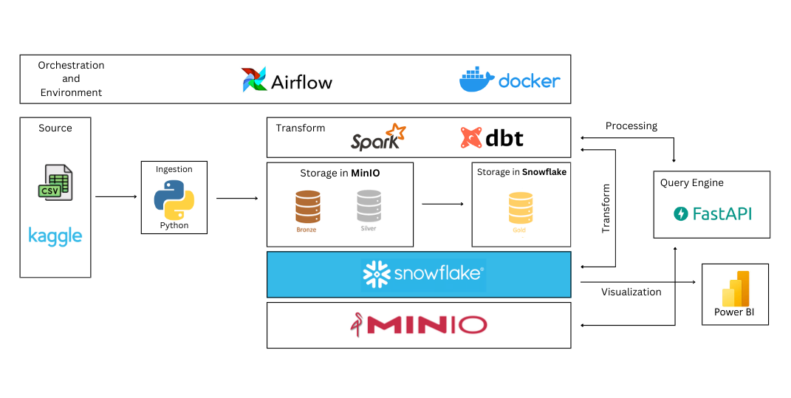

# 📊 DATA-WAREHOUSE-ACCIDENT-US-2016-2023

Design and implement a data warehouse to manage automobile accident cases across all 49 states in the US, using a star schema and Snowflake for the data warehouse architecture.

## 🚀 About Project

 - **Data Source**: This project uses data on [Kaggle](https://www.kaggle.com/) including 2 datasets: [US Accidents (2016 - 2023)](https://www.kaggle.com/datasets/sobhanmoosavi/us-accidents) and [Traffic Accidents and Vehicles](https://www.kaggle.com/datasets/tsiaras/uk-road-safety-accidents-and-vehicles)
   - `US Accidents (2016 - 2023`: This is a countrywide car accident dataset that covers 49 states of the USA. The accident data were collected from February 2016 to March 2023
   - `Traffic Accidents and Vehicles`: every line in the file represents the involvement of a unique vehicle in a unique traffic accident, featuring various vehicle and passenger properties as columns
 - **Extract Data**: Data is `extracted` from `csv` file then `ingested` into `MinIO` data lake in `bronze` folder using `Python` and `Airflow`
 - **Transform Data**: Data is retrieved from `MinIO's` `bronze` directory using `Spark` and `FastAPI` to perform `transformation` and `cleaning`, then the output is `loaded` into `MinIO's` `silver` directory.
 - **Load Data**: Once the data has been cleaned, we load it into the `Snowflake` data `warehouse` at Schema `Staging` using `Python` and `Airflow`.
 - **Warehouse**: Data is loaded into `staging` schema in `Snowflake`, Build and deploy `data warehouse` with `Star Schema` architecture by creating `dimension` and `fact` tables, to do this we use `DBT` to `transform` and `check data`.
 - **Serving**: Analyze data to improve road safety, identify high-risk accident areas to implement preventative measures. Identify factors that contribute to accidents (weather, road conditions, human error). Then visualize and create reports with `Power BI`.
 - **Package and Orchestration**: Components are packaged using `Docker` and orchestrated using `Apache Airflow`.

## 📦 Technologies

 - `Apache Airflow`
 - `Apache Spark`
 - `Docker`
 - `Dbt`
 - `Snowflake`
 - `MinIO`
 - `FastApi`
 - `Power BI`

## 🔦 Star Schema Diagram

